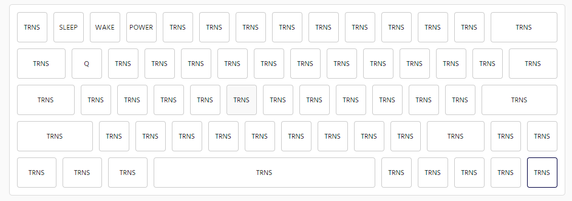

### DBMK60 firmware config :keyboard:

### :question: How to use

- If you have the same layout with my keyboard, use **db60-63keys.hex** instead
- If not:
  - Design your layout at [KLE](http://www.keyboard-layout-editor.com/)
  - Copy raw data and patse it into [kbfirmware](https://kbfirmware.com/).
  - Save json config file and copy keys section
    
  - Replace it with keys section in **db60.json** file in this repository
  - Import new file to [kbfirmware](https://kbfirmware.com/) and you can change keymap (if needed)
  - Flash your firmware and test it again
  - If some key does not work while testing try to re-design wiring
    _This is my keyboard's wiring_ 

### :hammer: Tools

- [QMK toolbox](https://github.com/qmk/qmk_toolbox/releases)

### :blush: My keymap:

[Keymap documentation](https://docs.qmk.fm/#/keycodes)

#### Layer 0

- Normal layout with 63 keys (60% profile)

#### Layer 1

- Add more FN key and ` for coding
- Shortcut for Shift + Windows + S (Snipping tool) : **MO(1) + UP**
- RGB setting: **Hold MO(1)** + _button_
  - **Q**: On/Off
  - **W**: Change mode
  - **E/D**: Increase/Decrease RGB hue color
  - **R/F**: Increase/Decrease RGB saturation color
  - **T/G**: Increase/Decrease RGB brightness color

#### Layer 2

- Fast shortcut: **Hold MO(2)** + _button_
  - **1**: Sleep mode
  - **2**: Wakeup mode
  - **3**: Shutdown mode

#### Goodluck :exclamation:

#### Enjoy your time with keyboard! It's fun :smile:
